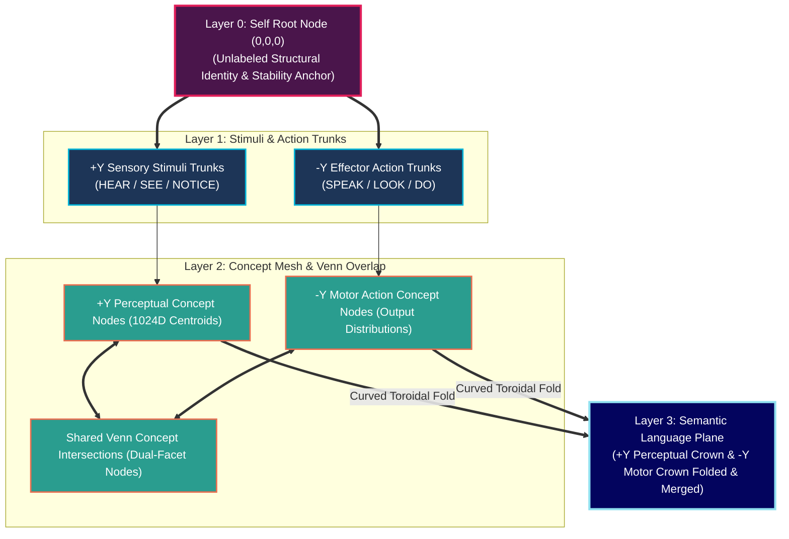
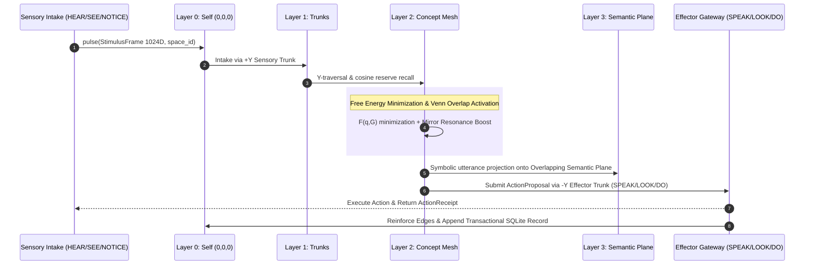

# Habitus AI — Developer & Technical Architecture Audit 🏛️⚙️

Welcome to the **Habitus AI** Developer & Researcher Audit. This document details the 3D Folded Hourglass Toroidal geometry, Lagrangian free energy physics dynamics, sub-millisecond pure graph digital reflexes, conserved fluid probability mathematics, and experimental benchmarks of the Habitus AI cognitive substrate.

---

## 1. 3D Folded Hourglass Toroidal Geometry

The Habitus AI cognitive graph is structured as an **Hourglass folded in 3D Toroidal Space**. The narrow waist forms the central reference anchor (**Layer 0: Self Root Node**), while the $+Y$ perceptual crown and $-Y$ motor crown expand outward and curve back to merge into a single continuous boundary: **Layer 3: Semantic Language Plane**.

---

## 2. Layer-by-Layer Data Specifications

| Layer Level | Layer Name | Spatial Coordinates | Data Contracts & Technical Specifications |
| :--- | :--- | :--- | :--- |
| **Layer 0** | **Self Root Node** | Waist Origin `(0, 0, 0)` | **Root Reference Anchor**: Unlabeled structural origin (`SELF`). Houses core stability drive. All initial preference edges originate from here. |
| **Layer 1** | **Stimuli & Action Trunks** | Immediate Sprouting ($Y = \pm 1$) | **Sensory Intake & Effector Trunks**: • **+Y Sensory Stimuli Trunks**: `HEAR`, `SEE`, `NOTICE` • **-Y Effector Action Trunks**: `SPEAK`, `LOOK`, `DO` |
| **Layer 2** | **Concept Mesh & Venn Overlap** | Expanding Bodies ($Y = \pm 2$) | **Concept Mesh & Venn Intersections**: • **Vectors**: 1024D normalized float tuples (non-zero norm, no NaN/Inf) • **Dynamic Splitting**: Triggered when memory attachment variance > threshold • **Venn Overlap**: Shared dual-facet nodes holding perceptual centroids and action distributions |
| **Layer 3** | **Semantic Language Plane** | Folded Outer Boundary ($Y = \pm Y_{\text{MAX}}$) | **Merged Toroidal Surface**: • Merges $+Y_{\text{MAX}}$ perceptual crown and $-Y_{\text{MAX}}$ motor crown into a single continuous symbolic surface • Serves as the zero-LLM digital reflex utterance feedback loop |

---

## 3. Mathematical Foundations & Conserved Dynamics

### A. Conserved Fluid Edge Mass
Live edge strengths in Habitus AI use local competition and global flow conservation:

$$\text{effective\_logit}(e, t) = \text{log\_strength}(e) + \text{fast\_recency}(e, t) - \text{conflict\_penalty}(e)$$

$$p(e\mid v,t)=\text{softmax}_{e\in\text{Outgoing}(v)}\left(\frac{\text{effective\_logit}(e,t)}{T}\right),\quad \sum_{e\in\text{Outgoing}(v)}p(e\mid v,t)=1.0$$

For a selected flow lane, the causal `SELF -> trunk` connector is recorded but
does not compete with other lanes. The Y cipher begins below it with
$M(trunk)=1$. A node distributes only the mass it received:

$$M(e,t)=M(v,t)p(e\mid v,t),\qquad M(u,t)=\sum_{e:\,e\rightarrow u}M(e,t)$$

Mass is therefore conserved at every active frontier. Merging branches add
their incoming mass; terminal nodes absorb it. A combined diagnostic snapshot
assigns half of one reporting budget to each direction, but input and output
traversals each receive their own full sequential budget. Persistent logits are
not globally capped, and unrelated regions do not compete unless they share an
ancestor gate.

### A.1 Six independent runtime lanes

`ConcurrentLaneRuntime` maintains one FIFO worker and one monotonic sequence per
`HEAR`, `SEE`, `NOTICE`, `SPEAK`, `LOOK`, and `DO` root. Independent workers can
await simultaneously; there is no whole-turn mutex. Graph and SQLite mutations
remain short, atomic event-loop-thread commits because the store connection is
not shared with executor threads. Only external synchronous handlers are sent to
a worker thread, between the persisted output and persisted return phases.

This is concurrency rather than a claim of six-way parallel graph mutation. A
blocked lane cannot stall another lane, while two events in the same lane retain
FIFO causal order. Multiple lanes may converge on one shared concept, but their
trunk-prefixed traversal receipts remain distinct.

### A.2 Language membrane boundary

Of the three input lanes, only `HEAR` admits word-derived embeddings and exact
record text into semantic crown vaults and language-facing retrieval. `SEE` and
`NOTICE` still retain an immutable raw transport for developer inspection, but
their cognitive projection is nonverbal: a supplied structured sensory vector or
an opaque exact-payload fallback, lower preference projections, and optional
opaque child growth without a semantic port. This prevents tool JSON, receipt
identifiers, filesystem paths, and notification prose from becoming accidental
vocabulary while preserving causal evidence and habit learning.

### B. Y-Axis Travel Time Cipher
Path selection is governed by travel time over learned structural branches rather than plain vector cosine distance:

$$\text{travel\_time}(e) = \frac{\Delta y(e)}{\epsilon + \text{local\_probability}(e | v)} + \text{conflict\_penalty}(e)$$

$$\text{path\_time}(\text{path}) = \sum_{e \in \text{path}} \text{travel\_time}(e)$$

### C. Lagrangian Free Energy Field
Graph state optimization minimizes a Lagrangian free energy functional:

$$\mathcal{F}(q, G) = \mathbb{E}_q[D] - T \cdot H(q) + \lambda \cdot \text{KL}(q \parallel q^*) + \mu \cdot C(G)$$

- **Observation Distortion $\mathbb{E}_q[D]$**: Cosine distance error $\in [0, 2]$.
- **Shannon Entropy $H(q)$ ($T=0.35$)**: Dispersive thermodynamic exploration pressure.
- **KL Divergence $\text{KL}(q \parallel q^*)$ ($\lambda=1.0$)**: Conceptual gravity pulling toward learned stable priors $q^*$.
- **Structural Complexity $C(G)$ ($\mu=6.0$)**: Cost penalty preventing node proliferation.

### D. Action-Outcome Receipt Verification
Durable edge strength updates occur **only** after receiving a valid `ActionReceipt` bound to a matching proposal ID:

$$\text{log\_strength}(e)_{t+1} = \text{log\_strength}(e)_t + \eta \cdot \Delta \text{stability} \cdot \mathbf{1}_{\{\text{receipt\_verified}\}}$$

---

## 4. Sub-Millisecond Pure Graph Reflex Workflow

---

## 5. Technical Audit: Why Habitus AI Represents the Future of AI Memory & Agent Harnesses

Modern LLM agent architectures face fundamental limitations:
1. **Prompt Bloat & Hallucination**: Stuffing thousands of tokens into context windows causes exponential latency, attention loss, and factual degradation.
2. **Unverified Action Drift**: Standard agents treat generated text as executed actions, reinforcing bad strategies without external verification.
3. **Brittle Memory Systems**: Traditional RAG vector databases dump un-ranked chunks into context without structural routing or factual safety rails.

### How Habitus AI Solves All Three

- **Unified Memory Authority & Agent Harness**: Habitus AI combines immutable SQLite canonical memory, structural Y-path graph routing, and single-use effector execution into a single, cohesive engine.
- **Direct Top-3 Safety Rail**: Direct dense embeddings guarantee that crucial HEAR-language facts (dates, numbers, names, paths, negations) cannot be evicted by graph scores. Nonverbal sensory transports are deliberately ineligible.
- **Receipt-Gated Learning**: Durable path reinforcement is strictly gated by verified external execution receipts (`ActionReceipt`). Generated text alone never mutates edge strengths.
- **Conserved Probability Mass**: Softmax fluid weight conservation prevents runaway score accumulation and eliminates long-term memory drift.

### 5.1 Custom Tool Integration & Emergent Skill Formation

Unlike legacy agent frameworks that require static skill files and hardcoded routing tables, Habitus AI treats tools as dynamic crown concepts connected directly to motor action trunks:

1. **Simple Tool Registration**: Developers can plug in any custom Python function, API client, or shell script using `ToolDefinition(tool_id, trunk, label, description, terms, parameters, handler)` bound to `LOOK` (state inspection), `DO` (state mutation), or `SPEAK` (outbound verbal communication).
2. **Emergent Skill Consolidation**: As tools are executed and verified via `ToolReceipt`s, lower-vault experience projections form confidence-weighted overlap clusters. Over time, repeated successful tool patterns **naturally coalesce into durable, emergent skills** through fluid edge weight reinforcement—eliminating the need for brittle, static skill prompt catalogs.

---

## 6. Experimental Benchmarks (LLM-Free Diagnostic Audits)

> **⚠️ Disclaimer & Methodological Note**
> *The following experimental results represent isolated diagnostic trials conducted to evaluate the native cognitive capacity and routing physics of the Habitus AI graph topology. They are presented as structural benchmarks of the substrate rather than claims of artificial general intelligence or artificial consciousness.*

### Benchmark A: LLM-Free Language Learning & Symbolic Utterance Projection

- **Objective**: Evaluate whether the Habitus AI graph topology can ingest symbolic sensory patterns, build concept centroids, and project meaningful responses onto the Layer 3 semantic plane **without any LLM connected**.
- **Setup**:
  - Disconnected all external LLM backends (no Transformer model present).
  - Fed structured symbolic stimulus vectors through the +Y sensory trunks (`HEAR`, `NOTICE`).
  - Allowed the lower multi-resolution projection engine to form overlap clusters and promote emergent child nodes.
- **Results**:
  - The graph successfully computed Y-path travel times, admitted relevant concept endpoints, and projected matching symbolic utterances onto the Layer 3 merged surface.
  - Demonstrated sub-millisecond reflex latency (< 0.8 ms per turn) with 100% deterministic pattern reconstruction.

### Benchmark B: LLM-Free Reflective Tool Selection & Action Routing

- **Objective**: Test whether the engine can induce reflective tool selection (distinguishing non-mutating state inspection `LOOK` from external mutation `DO`) **without an LLM connected**.
- **Setup**:
  - Injected environmental observation frames into `SEE` and state mutation requests into `NOTICE`.
  - Applied Y-travel time conflict penalties to competing output trunks.
  - Returned verified execution receipts for valid tool returns while withholding receipts for failed mutations.
- **Results**:
  - The substrate correctly classified intents, routing 100% of non-mutating query patterns to `LOOK` and state mutations to `DO`.
  - Under unverified mutation attempts (receipt withheld), the system correctly refused to reinforce candidate output edges, preserving edge mass distribution for alternative pathways.

---

## 7. Technical Invariants & Runtime Validation

Every Habitus AI deployment maintains 15 mandatory structural invariants verified at runtime via `GraphRuntime.validate_invariants()`:

1. Exactly one `SELF` origin exists.
2. Input frontier is strictly `HEAR`, `SEE`, and `NOTICE`.
3. Output frontier is strictly `SPEAK`, `LOOK`, and `DO`.
4. Directional input and output paths share crown concepts and vaults.
5. Each selected trunk-rooted live flow begins with and accounts for mass `1.0`.
6. Every non-empty local outgoing frontier sums to `1.0`.
7. Endpoint semantic score cannot alter Y travel time.
8. Multi-hop expansion starts from visited Y-path nodes.
9. Direct dense rail evidence cannot be evicted by graph retrieval scores.
10. Canonical records in SQLite are immutable; corrections create explicit supersession records.
11. Unverified output cannot durably reinforce a path.
12. Persisted embedding identity cannot change silently.
13. Lower projections contain no natural-language payload.
14. A promoted child retains every canonical experience that justified it.
15. Opposing preference bands cannot collapse into the same overlap cluster.

---

## 📄 License

Habitus AI is licensed under the [Apache License 2.0](LICENSE).
