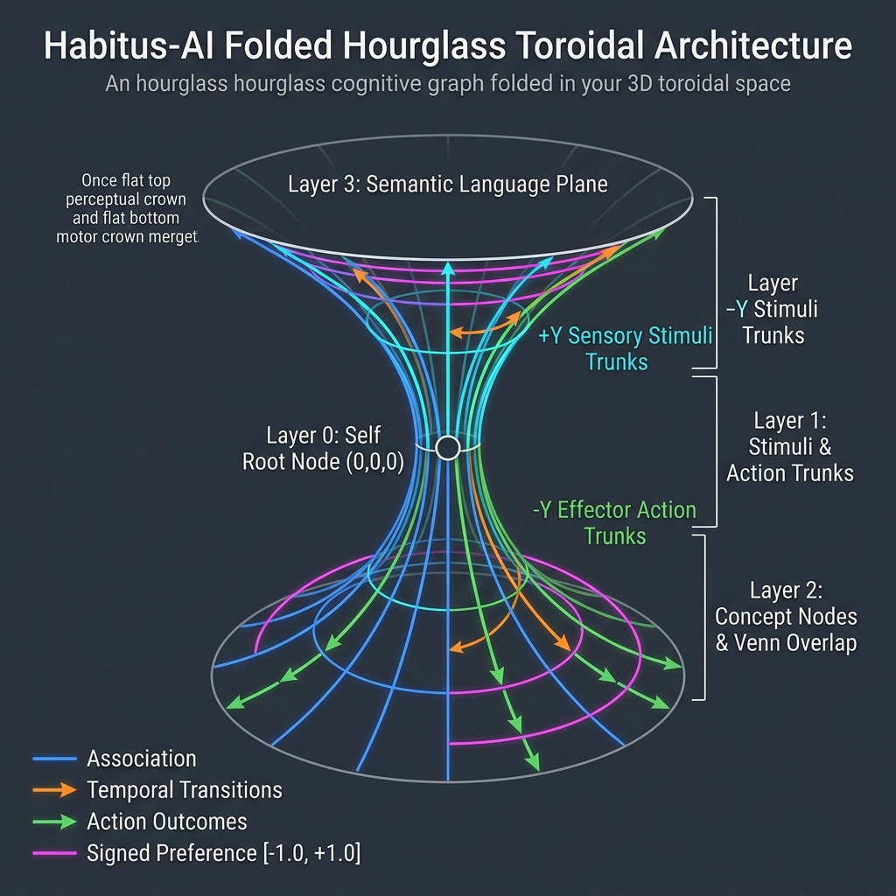

# Habitus AI 🏛️🧠

[](https://www.python.org/)
[](LICENSE)
[](#testing)
[](DEVELOPMENT.md)

**Habitus AI** (`habitus-ai`) is a lightweight, zero-external-runtime-dependency Python engine for dual-cipher, conserved-weight agentic memory and evidence-preserving RAG (Retrieval-Augmented Generation).

Named after the architectural concept of *habitus* (embodied, structural dispositions learned through experience), **Habitus AI** unifies long-term memory authority, structural graph routing, and action classification into a single, elegant cognitive substrate.

> This is the `experimental/six-lane-causal-membrane` branch. See
> **[EXPERIMENT.md](EXPERIMENT.md)** for its scope, clean-clone verification,
> causal language boundary, and evidence limits.

---

## 🎨 Architectural Geometry



---

## 🌟 How It Works (In Plain English)

Traditional AI memory relies on flat vector databases or massive prompt context dumps that cause hallucinations, prompt bloat, and context eviction. **Habitus AI** takes a radically different approach based on structural 3D geometry and conserved fluid dynamics:

### 1. The Hourglass Bicone Topology
Memory in Habitus AI is organized around an immutable center point called **`SELF`** (Layer 0):
- **+Y Perceptual Trunks (`HEAR`, `SEE`, `NOTICE`)**: Intakes conversational text, real-time tool returns, and background notifications.
- **-Y Effector Trunks (`SPEAK`, `LOOK`, `DO`)**: Classifies outbound action intents—distinguishing verbal responses (`SPEAK`), non-mutating inspections (`LOOK`), and external state changes (`DO`).
- **Semantic Crown**: Shared 1024D concept vectors and vault storage connecting sensory input to action output.

### 2. Dual-Cipher Y-Axis Traversal
Instead of pulling nearest-neighbor text snippets purely by cosine similarity, Habitus AI runs a **Y-axis travel time cipher**. It calculates structural depth, path travel times, and learned familiarity:
$$\text{travel\_time}(e) = \frac{\Delta y(e)}{\epsilon + \text{local\_probability}(e | v)} + \text{conflict\_penalty}(e)$$
Winning Y-paths activate visited node vaults for associative expansion, ensuring memory retrieval is guided by structural routing rather than simple keyword proximity.

### 3. Conserved Fluid Edge Weights
Each selected trunk receives its own mass `1.0` Y-cipher budget. Its causal connector from `SELF` remains in the trace, but is not softmaxed against the other five independent lanes. Every active node below that trunk softmaxes only its outgoing sibling edges and distributes the mass it received. Regional and per-layer totals are derived from that flow, so real competitors remain relative without letting unrelated senses or actions dilute a learned micro-habit.

### 4. Six Concurrent Flow Lanes
`ConcurrentLaneRuntime` gives `HEAR`, `SEE`, `NOTICE`, `SPEAK`, `LOOK`, and `DO` separate FIFO queues and sequence IDs. A waiting message, model generation, or external tool does not hold a global turn lock. Short graph/SQLite commits remain serialized on their owning event-loop thread, while slow synchronous handlers run off-thread and async handlers are awaited directly. Shared concepts can still receive activation from multiple lanes without collapsing their causal traces.

Only inbound language routed through `HEAR` is eligible to store word-derived
embeddings, enter semantic crown vaults, or appear in language-facing recall.
Textual `SEE` and `NOTICE` transports remain exactly inspectable in the immutable
developer ledger, but receive opaque fallback vectors and grow only nonverbal
lower concepts. Tool results and delivery receipts therefore teach consequences
without accidentally teaching JSON, paths, receipt IDs, or status prose as words.

### 5. Two-Lane Factual Safety Rail
- **Lane 1 (Direct Dense Rail)**: Locked top-3 dense nearest neighbors over language-eligible immutable records. HEAR-learned dates, numbers, names, paths, and negations cannot be evicted by graph scores; nonverbal sensory transports remain outside this rail.
- **Lane 2 (Graph Vault Retrieval)**: Traverses visited Y-paths $\rightarrow$ expands candidate vaults $\rightarrow$ applies hybrid Dense + BM25 reranking.

### 6. Gestation & Hatching

The scripted gestation adapter establishes the six core trunks and configurable
identity/taste seeds. Subsequent experience grows and reweights the graph; it
does not regenerate a fixed personality on every launch.

---

## 📊 Why Habitus AI? (Architecture Comparison)

| Capability / Feature | Traditional Vector RAG | Standard Graph RAG | Habitus AI 🏛️🧠 |
| :--- | :---: | :---: | :---: |
| **Memory Authority** | Loose Vector Chunks | Static Triples | **Immutable Canonical SQLite Records** |
| **Factual Safety Rail** | ❌ (Eviction Prone) | ❌ (Eviction Prone) | **✅ Direct Top-3 Rail (Zero Eviction)** |
| **Action Classification** | ❌ (LLM Prompt Guesses) | ❌ (None) | **✅ Classified Trunks (`SPEAK`/`LOOK`/`DO`)** |
| **Durable Learning** | ❌ (Unverified Context) | ❌ (Manual Schema) | **✅ Receipt-Gated (`ActionReceipt` verified)** |
| **Probability Mechanics** | N/A | Accumulating Scores | **✅ Softmax Fluid Weight Conservation ($\sum=1.0$)** |
| **Runtime Dependencies** | External Vector DB | Neo4j / NetworkX | **⚡ 0 External DBs (Pure Python + SQLite)** |

---

## 🚀 Endless Possibilities for Habitus AI

- 🤖 **Zero-Drift Autonomous Agents**: Persistent identity and evidence memory that survive process restarts without context drift.
- 🛡️ **Receipt-Gated Action Verification**: Agents learn durably **only** after receiving a verified external execution receipt (`ActionReceipt`). Unverified internal model chatter cannot corrupt edge weights.
- 🛠️ **Built-in Operational Tool Suite & Trunk Binding**: Includes standard tools (`read_file`, `write_file`, `inspect_directory`, `execute_python`, `web_search`, `send_message`) pre-bound to motor trunks (`LOOK`, `DO`, `SPEAK`), generating verified receipts (`ToolReceipt`).
- ⚡ **Ultra-Fast Local Execution**: 0 external database servers required; runs entirely in pure Python standard library and SQLite with optional vector database adapters (ChromaDB, Pinecone, pgvector).

---

## 🐣 Quick Start for Testers

### 1. Installation

```bash
git clone https://github.com/munch2u-a11y/Habitus-AI.git
cd habitus-ai
pip install -e '.[test]'
```

### 2. Launch the Interactive Web App Launcher 🌐🐣

Launch the visual web launcher with auto-detection of local models, developer tools manager, and an animated egg gestation modal:

```bash
habitus-launch
```

- **Auto-Detect Models**: Automatically queries local Ollama models (`http://127.0.0.1:11434/api/tags`).
- **Animated Gestation Progress**: Watch the egg sprite 🥚 float & glow with a live `0%` $\rightarrow$ `100%` progress bar.
- **Developer Tools Tab**: Load and manage single-use execution gateway tools (`LOOK`, `DO`, `SPEAK`).
- **Interactive Chat**: Chat with responses classified into motor trunks (`SPEAK`, `LOOK`, `DO`) and Y-paths traversed.

### 3. Terminal CLI Setup & Hatching

During chat:
- Type `/status` to inspect record counts, crown concepts, total edges, and graph health.
- Type `/quit` to safely exit.

### 3. Scripted Gestation

```bash
habitus-gestate \
  --human-name Josh \
  --agent-name Nova \
  --taste curious \
  --model granite4.1:8b

habitus-hatch
```

### 4. Run the Pipeline Demo

```bash
habitus-demo
```

### 5. Run Automated Tests

```bash
python3 -m pytest -v
```

### 6. Registering Tools & Verified Receipts

```python
from habitus_ai import HabitusAI, OutputTrunk
from habitus_ai.tools import ToolRegistry, BUILTIN_OPERATIONAL_TOOLS

mind = HabitusAI("habitus_memory.sqlite")
registry = ToolRegistry(mind)

# Register operational tools bound to motor trunks (LOOK, DO, SPEAK)
for tool in BUILTIN_OPERATIONAL_TOOLS:
    registry.register_tool(tool)

# Execute one persisted output -> observed return -> SELF cycle
receipt = registry.execute("tool:read_file", {"filepath": "README.md"})
print("Verified:", receipt.verified, "| Output size:", receipt.output["size_bytes"])
print("Causal cycle:", receipt.cycle_id, "| Return:", receipt.return_record_id)
```

For independent intake and action scheduling:

```python
import asyncio
from habitus_ai import ConcurrentLaneRuntime, InputTrunk

async def pulse():
    async with ConcurrentLaneRuntime(mind) as lanes:
        seen, acted = await asyncio.gather(
            lanes.ingest("tool return", trunk=InputTrunk.SEE),
            lanes.execute_tool(registry, "tool:read_file", {"filepath": "README.md"}),
        )

asyncio.run(pulse())
```

#### 💡 Custom Tools & How "Skills" Form Naturally

In traditional frameworks, developers must write complex prompt catalogs and manual tool routing rules. In **Habitus AI**:

- **Plug In Whatever Tools You Want**: Register any custom Python function, REST API, DB query, or system command using `ToolDefinition` bound to the appropriate motor trunk (`LOOK` for inspections, `DO` for state mutations, `SPEAK` for verbal notifications).
- **Habits from Consequences**: A tool call is persisted before execution. Its structured success or error is stored as the return of that same experience, and verified stability feedback changes the exact output path that produced it. Repeated state-specific success can therefore become a durable action preference without a skill file.
- **Inspectable Causality**: `ToolReceipt` exposes the cycle, output-record, return-record, and outcome IDs. The immutable records remain readable for development while lower graph projections carry modality, preference, and path activation.

Run the sealed, non-language action curriculum with:

```bash
make -C experiments/graph_native_live embodied-nursery
```

Its controlled baseline currently tests whether opaque state paths learn five
appropriate actions through real successes and safe errors. It is a structural
habit-learning test, not a claim of general intelligence.

### 7. Verbal Audio Reflex Bridge (Piper TTS & STT Intake)

```python
from habitus_ai import HabitusAI
from habitus_ai.audio import AudioReflexBridge

mind = HabitusAI("habitus_memory.sqlite")
audio_bridge = AudioReflexBridge(mind, piper_model="en_US-lessac-medium")

# Execute verbal intake -> Y-traversal -> TTS speech synthesis reflex
result = audio_bridge.process_reflex_turn("Hello Nova")

print("Spoken output:", result["spoken_text"])
print("Trunk classified:", result["classified_trunk"])
print("Audio WAV path:", result["audio_path"])
print("Verified receipt:", result["receipt"].receipt_id)
```

---

## 📚 Developer & Researcher Documentation

The **[experimental engineering white paper](WHITEPAPER.md)** presents the
architecture, equations, developmental language bridge, controlled GGUF results,
negative controls, limitations, artifact hashes, and falsifiable next experiments.

The [graph-native live experiment notes](experiments/graph_native_live/README.md)
include the target-free outbound Y traversal, separate communication/navigation/
action membranes, and the frozen 36-topic routing ablation.

For deep technical audits, mathematical derivations, sequence workflow diagrams, and our LLM-free experimental benchmarks (language projection & reflective tool routing without an LLM), read the **[Developer & Architectural Audit (DEVELOPMENT.md)](DEVELOPMENT.md)**.

---

## 📄 License

Licensed under the [Apache License 2.0](LICENSE).
