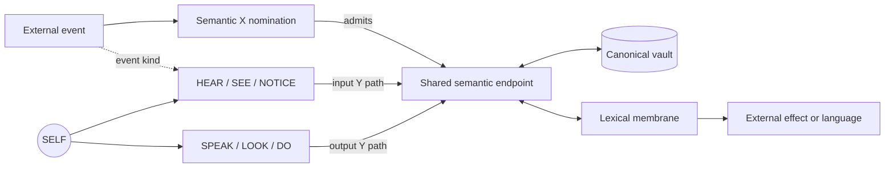
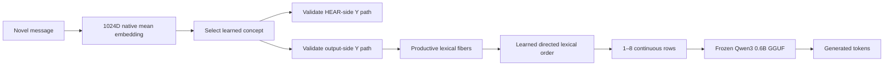

# Habitus AI

## A Conserved Dual-Graph Substrate for Developmental Memory and Continuous Transformer Conditioning

**Experimental engineering white paper — version 0.2.0**

**HUMAN Project & Fractal Memory Contributors**
**28 August 2026**

> **Status.** Habitus is a research prototype, not a claim of artificial general
> intelligence, consciousness, or a production replacement for retrieval-augmented
> generation. This paper reports what the current implementation and controlled
> receipts establish, distinguishes those results from design hypotheses, and gives
> concrete tests that could falsify the stronger claims.

## Abstract

Most agent-memory systems maintain several loosely coupled mechanisms: a vector
store for factual recall, a prompt composer for context, a graph or workflow for
actions, and additional stores for preferences, skills, and recent state. Habitus
investigates a more unified substrate. It begins at one persistent `SELF` origin,
separates incoming events from outgoing effects with mirrored directional graphs,
and shares a semantic crown between them. A semantic X pass nominates endpoints;
an independent Y pass finds the minimum-travel-time route through learned,
hierarchically conserved edge flow. Immutable SQLite records remain the factual
authority while language-free projections, overlap clusters, lexical fibers, and
route reinforcement allow the graph to change during ordinary experience.

This report also describes a developmental bridge between that graph and a frozen
Qwen3 0.6B GGUF model. A controlled 432-episode curriculum produced a persistent
mind containing 494 records, 276 nodes, 1,379 directional edges, 43 promoted
overlap clusters, and a 171-node lexical membrane. Label-absent semantic probes
selected the intended learned concept in 16 of 18 cases. Reverse projection from
graph state into the model's complete vocabulary matrix recovered the intended
token at rank 1 in 16 of 18 cases and within rank 5 in all 18; a shuffled control
scored 0 of 18 at rank 1. Finally, four novel messages were resolved by the graph
and converted into at most eight continuous 1024-dimensional input rows for the
frozen transformer. No user string, retrieved memory text, user token sequence,
or hand-authored semantic codebook crossed that boundary. All four target runs
named the intended concept and were closer to it than unrelated and random-row
controls.

These are narrow but falsifiable results. They demonstrate persistent graph
growth, learned lexical association and order, reversible graph-to-vocabulary
projection, and semantic influence on generation through continuous input
embeddings. They do not yet demonstrate arbitrary factual recall through the
continuous interface, unsupervised language acquisition, general action
selection, superiority to text RAG, or upper-transformer-layer control.

## 1. Research question

The central question is not whether a graph can imitate a language model. It is
whether one compact, persistent structure can carry more of an agent's continuity:

- what has happened;
- which concepts are active;
- how those concepts have been reached before;
- which routes tended to precede stable or unstable outcomes;
- which inputs and actions co-occurred;
- which language forms became associated with those internal patterns; and
- which bounded state can condition a language model without serializing the
  agent's entire memory back into prose every turn.

Habitus treats these as different resolutions of one growing history rather than
independent personality, affect, skill, workflow, and memory sidecars. The design
deliberately preserves one exception: canonical factual records remain immutable
evidence. Learned route strength can alter attention and action preference, but it
cannot turn familiarity into truth.

## 2. Contributions

The present implementation contributes nine testable mechanisms.

1. **A dual directional graph with one origin.** Three causal input trunks
   (`HEAR`, `SEE`, `NOTICE`) and three effect trunks (`SPEAK`, `LOOK`, `DO`) begin
   at `SELF` and meet at shared semantic concepts.
2. **Independent X and Y routing.** Semantic similarity nominates the endpoint;
   a Dijkstra-style traversal chooses the internal route using depth, learned
   local probability, recency, and conflict cost. X cannot secretly alter Y cost.
3. **Conserved hierarchical edge flow.** Every selected trunk-rooted cipher
   begins with mass one. Each node softmaxes only its outgoing siblings and
   distributes the mass it received, producing derived trunk, regional, and
   layer totals without making unrelated branches compete.
4. **Multi-resolution persistent memory.** One immutable HEAR event can be
   referenced by a language-bearing crown vault and by lower, language-free
   projections. SEE and NOTICE events retain only the latter cognitive form,
   while their raw transport remains available to the developer ledger.
5. **Evidence-backed recursive growth.** Repeated, preference-compatible vector
   overlap within a parent vault promotes an opaque child and a separate semantic
   port. The same kernel can operate again with a learned concept as parent.
6. **A learned lexical membrane.** Opaque concepts connect to lexical-geometry
   nodes and directed word-transition edges. Productive activation can be mapped
   back through the frozen model's full vocabulary geometry without reading token
   IDs from graph metadata.
7. **A native continuous-input seam.** Learned graph-selected rows can enter a
   matching-width GGUF model directly, inside fixed empty chat delimiters, before
   normal autoregressive generation.
8. **Six independent runtime lanes.** The three sensory and three action roots
   have separate FIFO queues and sequence IDs. Slow environment or model waits
   do not impose a global turn lock, while graph/store commits stay serialized
   on the SQLite-owning event-loop thread.
9. **A causally exclusive language membrane.** Only inbound `HEAR` records may
   preserve word-derived embeddings in semantic vaults or language recall.
   `SEE` and `NOTICE` retain inspectable evidence but grow nonverbal structure.

The source of authority for these claims is the implementation under
[`src/habitus_ai`](src/habitus_ai), the experimental programs under
[`experiments/graph_native_live`](experiments/graph_native_live), and the receipts
identified in Section 9—not this prose alone.

## 3. Architecture

### 3.1 The folded bicone

The topology is easiest to draw as an hourglass, although the implementation does
not require literal Cartesian coordinates.



The diagram is folded for readability. Every trace begins at `SELF`, but a
selected Y cipher's competitive flow begins at its causally known trunk. The
`SELF -> trunk` connector is retained for provenance and reinforcement and is
assigned fixed connector cost; it is not normalized against unrelated lanes.
X supplies the admitted target. Input and output edges are distinct and
directional. A concept identity, vector, and vault can be shared across both
sides. This gives the same concept a receptive and productive path without
requiring the routes—or their active lane queues—to be identical.

The basal trunks are intentionally few and pre-seeded. They are closer to
interface categories than semantic subjects:

| Side | Trunk | Operational meaning |
|---|---|---|
| Input | `HEAR` | Immediate message or conversational input |
| Input | `SEE` | Immediate correlated observation or tool return |
| Input | `NOTICE` | Delayed or uncorrelated notification/observation |
| Output | `SPEAK` | External communication |
| Output | `LOOK` | Information acquisition without intended mutation |
| Output | `DO` | External execution or mutation |

Input routing uses event metadata rather than guessing from prose. Output
classification is a proposal, not proof that an action happened. Durable action
learning requires a verified receipt.

### 3.2 X nominates; Y traverses

For an input vector, the semantic surface combines non-negative cosine similarity
and lexical overlap to rank crown concepts. This X pass determines which endpoints
may be considered. Once a target endpoint is chosen, its semantic score is frozen
as trace metadata; it does not enter edge travel time.

Normalized Shannon entropy over the preliminary X scores measures ambiguity. A
low-entropy surface admits fewer endpoints and a smaller associative recall budget;
a diffuse surface admits more endpoints, more vault candidates, and—within a hard
maximum—a larger rendered context. Entropy changes how broadly the system looks,
not how cheaply Y can reach any particular target.

For every live edge \(e\), Habitus computes a fast-decaying recency term

\[
r_e(t)=\alpha 2^{-a_e(t)/h},
\]

where \(a_e(t)\) is time since the edge was last active, \(h\) is the recency
half-life, and \(\alpha\) is bounded recency strength. Its effective logit is

\[
\ell_e(t)=s_e+r_e(t)-c_e,
\]

where \(s_e\) is durable log-strength and \(c_e\) is a learned conflict penalty.
At each active node, the live conditional mass is

\[
p(e\mid v,t)=\frac{\exp(\ell_e(t)/T)}
 {\sum_{j\in\operatorname{out}(v)}\exp(\ell_j(t)/T)},
\qquad \sum_{e\in\operatorname{out}(v)}p(e\mid v,t)=1.
\]

The selected trunk starts with \(M(trunk)=1\), and received mass propagates as

\[
M(e,t)=M(v,t)p(e\mid v,t),\qquad
M(u,t)=\sum_{e:e\rightarrow u}M(e,t).
\]

The edge's Y travel time is

\[
\tau_e(t)=\frac{\Delta y_e}{\varepsilon+p(e\mid v,t)}+c_e.
\]

A Dijkstra-style search then finds

\[
P^*(z)=\arg\min_{P:\,trunk\rightarrow z}\sum_{e\in P}\tau_e(t)
\]

for the X-nominated endpoint \(z\). The initial causal input trunk is enforced as
a path constraint. Consequently, a semantically relevant destination cannot pull
the cipher across the wrong stimulus trunk, and a familiar route cannot substitute
a semantically unrelated destination.

“Path of least resistance” is therefore not shortest hop count. A deeper but
well-reinforced path can beat a shallow weak or conflict-laden route, while every
edge still pays a positive depth cost.

### 3.3 Relative learning

Verified feedback credits a path rather than an isolated label. For \(m\) unique
credited edges, stability \(d\in[-1,1]\), evidence quality \(q\in[0,1]\), and
learning rate \(\eta\), each edge receives

\[
\Delta s_e=\frac{\eta d q}{m}.
\]

Negative feedback also increases conflict cost; later positive feedback decays it.
The next live sibling softmax makes a reinforced edge stronger relative to edges
leaving the same node. That changed conditional probability then propagates from
the selected trunk, reallocating mass through its descendants. Unrelated
branches do not lose mass unless they share a genuine ancestor within that lane. Stored
log-strengths themselves remain uncapped; conservation applies to the bounded live
flow, not to historical logits or to the sum of edge occupancy across many depths.

This mechanism gives the system a minimal operational form of habit: routes that
repeatedly receive verified positive outcomes become easier relative to their
alternatives. It does not prove that every useful skill will emerge, and it does
not make repeated beliefs factually correct.

The design was inspired in part by energy-minimization and conceptual-gravity
metaphors, but the current implementation should not be called a Lagrangian growth
law. It minimizes an explicit additive graph cost and applies a reinforcement
update; it does not define or optimize an action functional over graph evolution.

### 3.4 Concurrent lane scheduling

The scheduler is deliberately narrower than “parallel cognition.” Each of the
six trunks owns a FIFO queue and sequence. Awaiting model generation in `SPEAK`
does not prevent a `DO` handler or `SEE` return from advancing; similarly, a
waiting `HEAR` event does not block `SEE` or `NOTICE`. Same-lane order remains
causal. External synchronous handlers run in worker threads, but all graph and
SQLite commits occur on the event-loop thread before and after that wait. Shared
concepts permit later cross-modal association without interleaving the original
trunk-prefixed traces.

## 4. Memory at multiple resolutions

### 4.1 One event, several projections

SQLite is the persistent authority. A canonical record stores the exact raw
transport, timestamp, source, type, embedding, metadata, and provenance for
audit. The `membrane_words` marker separately governs whether that text is
cognitive language memory. Corrections create new records and supersession links
instead of overwriting history.

The same event carries an `experience_id` into lower projections:

| Layer | Stored role | Language payload |
|---|---|---|
| 0 | `SELF` activation and preference state | None in the lower projection |
| 1 | Causal stimulus trunk | None in the lower projection |
| 2 | `STABLE`, `NEUTRAL`, or `UNSTABLE` band | None in the lower projection |
| 3+ | Opaque promoted children and recursive assemblies | None in child nodes |
| Crown | HEAR semantic port, vector, canonical record references | Exact HEAR records only |
| Membrane | Opaque lexical geometry and learned transitions | Geometry, not stored word/token labels |

The `experience_projections` ledger contains record and experience IDs, node,
layer, side, activation, preference, confidence, pulse, and structural metadata.
It has no natural-language column. If later verified feedback changes the
experience's preference estimate, lower projections sharing that experience ID
are updated without changing the canonical transport record.

This separation matters. A route may become familiar, attractive, or avoided
without becoming a source of factual authority. Conversely, the exact wording of
a date, path, number, name, or negation learned through HEAR remains recoverable
from the immutable record rather than a compressed graph summary. Raw SEE and
NOTICE text is audit evidence, not language-facing memory.

### 4.2 Two retrieval lanes

The normal Habitus RAG path retains two independent recall lanes:

```text
query
  ├── direct dense top 3 over language-eligible canonical records
  └── X endpoints → Y paths → visited vaults → dense + BM25 reranking
```

The direct lane is a factual safety rail. The graph lane adds learned associative
relevance but cannot evict direct hits. Lanes merge by canonical record ID, and
context rendering preserves exact eligible record text. This paper's continuous-transformer
experiment intentionally bypasses that rendered text to isolate a different
question: whether graph state alone can carry useful semantic influence.

## 5. Growth from experience

### 5.1 Basal deposition

Every incoming experience is projected through `SELF`, its causal input trunk,
and one preference band. Preference observations are clipped to \([-1,1]\) and
accumulated as a confidence-weighted mean. The three bands are routing regions,
not hard-coded emotions.

### 5.2 Overlap clustering and promotion

Inside a parent vault, a new experience \(x\) may join cluster \(C\) when

\[
\cos(x,\mu_C)\geq\theta
\quad\text{and}\quad
|p_x-\bar p_C|\leq\delta,
\]

where \(\mu_C\) is the normalized incremental centroid, \(p\) is remembered
preference, \(\theta\) is the overlap threshold, and \(\delta\) is preference
tolerance. Distinct experience IDs are required. In ordinary runtime the support
threshold grows with the parent vault:

\[
k_C=\max\left(k_0,\left\lceil\log_2(N_{parent}+1)\right\rceil\right).
\]

The accelerated compiler uses an explicit support threshold of three to keep the
controlled experiment tractable.

HEAR promotion creates two nodes:

```text
lower parent
  → opaque child: zero semantic vector, no terms, numeric lower vault
      → semantic port: evidence centroid, derived terms, canonical vault
```

The supporting record IDs justify both edges and bridge the layers. Semantic
similarity cannot manufacture lower ancestry after the fact. The same
`stage_growth` kernel can be applied with a learned semantic concept as the next
parent, allowing recursive assemblies rather than a one-off hierarchy builder.

SEE and NOTICE use the same overlap and support mathematics but stop at the
opaque child. They do not derive terms, create a semantic port, or make their raw
transport retrievable as prose. When no structured sensory embedding is supplied,
an exact-payload cryptographic direction provides a stable nonlexical fallback.

The present implementation can add relations and new branches recursively. It
does not yet implement destructive branch merging. That omission is intentional:
prematurely merging two nearby vectors would destroy provenance. A future merge
mechanism should first create reversible bridges and earn consolidation through
subsequent evidence.

## 6. Developmental language bridge

### 6.1 Why a membrane

The graph and the frozen transformer do not begin with the same learned geometry.
A human learner can attach sounds to an already developing sensorimotor world;
an existing language model arrives with a mature, inaccessible internal language
space. Habitus therefore uses the model's own input embedding width as a boundary
surface. Concepts remain graph-native below it, while co-active lexical geometry
learns where those concepts touch the model's language manifold.

This is an alignment interface, not a claim that the graph independently invented
the pretrained model's vocabulary.

### 6.2 Tiny nursery

The first nursery taught three surface forms separately: `I`, ` like`, and
` Josh`. The complete phrase was never presented. Each exposure co-activated one
opaque lower concept and one exact Qwen lexical embedding, creating receptive and
weaker provisional productive fibers. A held-out output traversal recovered and
composed `I like Josh`. A substitution curriculum produced `I prefer music`;
shuffled and untrained controls failed.

This establishes label binding and ordered composition in a deliberately tiny
environment. It is not open-ended language generation.

### 6.3 Reverse nursery

The stronger reverse test removed token IDs and words from graph-node metadata.
A lexical node ID is a hash of its 1024-dimensional geometry. Productive fibers
blend the active lexical rows, and a native codec searches the complete
`token_embd.weight` vocabulary matrix for nearest tokens. The same primary and
substitution curricula passed; shuffled and untrained controls remained negative.

The reverse nursery demonstrates that the outward path can recover language from
learned geometry without a diagnostic token lookup. It still uses pretrained Qwen
geometry and does not invoke transformer inference.

### 6.4 Accelerated gestation

Waiting for a graph to accumulate years of ordinary interaction is unsuitable for
an architectural test, so the accelerated compiler replays a deterministic,
controlled curriculum through the same persistent store and growth kernel.

- 36 topics span social, affect, knowledge, digital, agency, and world domains.
- Six paraphrase frames and two replay cycles produce 432 developmental episodes.
- Each text is embedded by averaging its exact Qwen GGUF token-embedding rows,
  yielding a 1024-dimensional vector. These are static lexical averages, not
  contextual hidden states.
- The overlap threshold is calibrated between within-topic and matched
  between-topic distributions. In the reported run it was `0.6446264586`.
- Topic clusters promote through the ordinary opaque-child/semantic-port kernel.
- Output paths are mirrored according to the teacher-supplied action class.
- Cross-modal schooling gives already-grown concepts a legal `HEAR` route when a
  caregiver label co-occurs with the active concept.
- Teacher-supplied category sessions reuse `stage_growth` with learned concepts
  as parents, forming six category and two domain assemblies.
- Up to six frequent content words per topic create 171 opaque lexical-geometry
  nodes, 420 input/output fibers, and 358 directed lexical transition edges
  learned from within-episode word order.

The graph does not store words or token IDs on those lexeme nodes, but the
compiler receipt does preserve a human-readable diagnostic mapping. Topic labels,
categories, action trunks, and schooling episodes are supervised. Results from
this process must therefore be described as developmental compilation, not
spontaneous unsupervised emergence.

## 7. Continuous transformer interface

### 7.1 Boundary packet

For a novel message, the accelerated experiment performs the following sequence:



The selected concept's strongest productive lexeme starts the sequence. A greedy
walk follows learned directed lexeme-to-lexeme transitions, using productive
probability as a fallback. Each selected lexeme contributes its normalized native
1024-dimensional embedding row. The packet format caps the sequence at eight rows
and rejects non-finite, zero-width, or trailing data.

The C++ runner places those rows on the average norm shell of the model's own
structural embeddings. It surrounds them with fixed Qwen chat-control rows:

```text
<|im_start|>user\n
    [graph-selected continuous rows]
<|im_end|>\n<|im_start|>assistant\n
    [fixed empty reasoning delimiters in the reported matrix]
```

The delimiters establish the model role and contain no user or recalled-memory
content. The initial batch is passed through llama.cpp's embedding input; normal
autoregressive decoding follows with top-k 40, top-p 0.90, temperature 0.70, and
seed 42.

This is accurately described as **continuous input-embedding conditioning** or a
learned soft-input seam. “No natural-language prompt injection” is true only in
the content sense: no user prompt or memory prose crosses the boundary. It would
be misleading to say that the model receives no input, no linguistic information,
or no prompt-like conditioning. The learned lexical rows carry language geometry,
and fixed control-token embeddings remain necessary. No upper transformer layer
is modified.

## 8. Evaluation

### 8.1 Evidence classes

The evaluation keeps five claims separate:

1. **Structural validity:** required trunks exist, local and global masses
   normalize, and promoted children remain opaque and linked to their overlap
   clusters and semantic ports.
2. **Persistent growth:** counts and invariants survive closing and reopening the
   SQLite database.
3. **Receptive concept selection:** held-out input resolves to its intended learned
   concept, including probes that omit the topic label.
4. **Productive lexical recovery:** graph state projects to the intended vocabulary
   item under full-vocabulary nearest-neighbor decoding.
5. **Transformer influence:** target graph rows produce output more related to the
   selected concept than unrelated or deterministic random rows under a fixed
   model and sampler.

Passing one class does not imply the others. In particular, coherent generation is
not factual recall, and a correct concept word is not a correct answer to an
arbitrary question.

### 8.2 Accelerated-mind snapshot

| Measure | Result |
|---|---:|
| Curriculum topics | 36 |
| Curriculum episodes | 432 |
| Total persistent records after setup/schooling | 494 |
| Nodes | 276 |
| Input/output directional edges | 708 / 671 |
| Total edges | 1,379 |
| Promoted overlap clusters | 43 |
| Lexeme nodes | 171 |
| Productive and receptive lexical fibers | 420 |
| Directed lexical transition edges | 358 |
| Language-schooled concepts | 35 |
| Category/domain recursive assemblies | 6 / 2 |
| Deepest demonstrated input/output assembly paths | 8 / 7 edges |
| Global live edge mass | 1.0 |
| Invariant errors before restart | 0 |
| Restart counts matched | Yes |
| Invariant errors after restart | 0 |

The average topic-cluster purity was approximately `0.9857`. This is a curriculum
separation result, not a real-world ontology score.

### 8.3 Receptive and productive tests

| Test | Result |
|---|---:|
| Label-present topic coverage, top 1 | 35/36 (97.22%) |
| Label-present topic coverage, top 3 | 35/36 (97.22%) |
| Label-absent semantic paraphrases, top 1 | 16/18 (88.89%) |
| Label-absent semantic paraphrases, top 3 | 16/18 (88.89%) |
| Legal Y reachability for semantic probes | 18/18 (100%) |
| Probe-text leakage into training set | 0/18 |
| Graph-to-vocabulary recovery, top 1 | 16/18 (88.89%) |
| Graph-to-vocabulary recovery, top 5 | 18/18 (100%) |
| Shuffled-label recovery, top 1 | 0/18 (0%) |

The two strict receptive misses were semantically interpretable collisions:
`tools` selected `executing`, while `tests` shared the promoted `verifying`
concept. They are still failures under the locked labels and reveal that the
current centroid geometry can merge neighboring operational concepts.

### 8.4 Graph-to-transformer matrix

Four novel paraphrases were embedded, resolved to a learned concept, and compared
under four conditions: learned target order, reversed target rows, the
least-related learned concept, and deterministic random opaque rows. Model,
sampling parameters, row cap, and chat delimiters were held constant.

| Target | Learned target | Reversed | Unrelated | Random | Expected word in target |
|---|---:|---:|---:|---:|:---:|
| trust | 0.5431 | 0.4296 | 0.0828 | 0.3130 | Yes |
| fear | 0.4478 | 0.4462 | 0.3493 | 0.3557 | Yes |
| evidence | 0.5969 | 0.5777 | 0.3755 | 0.3977 | Yes |
| music | 0.4523 | 0.5589 | 0.3034 | 0.2845 | Yes |

Values are cosine similarity between the generated response's averaged native
token embeddings and the selected concept centroid. The learned target beat the
unrelated and random controls in all four cases, and all learned transition walks
had zero missing edges. Learned order beat reversal in three of four cases; the
reversed music sequence scored higher, so ordering is not solved.

Representative target outputs included:

- **trust:** “Yes, trusting reliable behavior can make cooperation feel more
  rewarding and effective…”
- **fear:** a discussion linking fear, unfamiliarity, danger, predicted loss, and
  stability;
- **evidence:** an explanation of how observations can support or weaken a factual
  claim;
- **music:** a discussion of organized music, melody, and expectation.

The responses were natural language and concept-relevant, but some treated the
continuous rows as a phrase to interpret rather than an instruction to answer.
The evidence response also began with an unnecessary correction. The experiment
therefore establishes semantic steering, not robust conversational intent.

## 9. Reproducibility and receipts

### 9.1 Environment

The reported developmental and transformer runs used:

- Python 3.11 or newer;
- `Qwen3-0.6B-Q8_0.gguf` at native input width 1024;
- the llama.cpp headers and libraries matched to the installed Ollama runtime;
- CPU decoding with four threads in the native runner;
- SQLite persistence; and
- fixed transformer sampling seed 42.

The model file is not distributed by this repository. Model version, quantization,
tokenizer, llama.cpp ABI, and sampling parameters are part of the experimental
condition and should not be silently changed in a replication.

The exact local model used in the reported receipts was 639,446,688 bytes with
SHA-256 `9465e63a22add5354d9bb4b99e90117043c7124007664907259bd16d043bb031`.

### 9.2 Commands

```bash
# Build the native GGUF codec and continuous-input runner
make -C experiments/graph_native_live build

# Compile a fresh persistent developmental mind
make -C experiments/graph_native_live gestate-fast

# Run a conversational one-word graph probe against the emitted SQLite snapshot
PYTHONPATH=src python3 experiments/graph_native_live/probe_hatched_mind.py \
  --database experiments/graph_native_live/accelerated_gestation_runs/MIND.sqlite

# Run the four-probe target/reversal/unrelated/random transformer matrix
PYTHONPATH=src python3 experiments/graph_native_live/transformer_hatch.py \
  --database experiments/graph_native_live/accelerated_gestation_runs/MIND.sqlite

# Run the complete deterministic test suite
PYTHONDONTWRITEBYTECODE=1 PYTHONPATH=src python3 -m pytest -q
```

`MIND.sqlite` above is a placeholder for the filename printed by the gestation
command. The scripts refuse to overwrite an existing mind.

### 9.3 Audited local artifacts

The results in this paper were read directly from the following local artifacts.
Generated run directories are intentionally ignored by Git, so these hashes are
an evidence manifest, not a promise that the files are present in every clone.

| Artifact | Size | SHA-256 |
|---|---:|---|
| `accelerated_gestation_runs/gestation-1787966680339559785.json` | 42,857 B | `261651305d301d149870901708188b6ab4fee4a71106cfa646f0b97ae32cd1e6` |
| `accelerated_gestation_runs/habitus-1787966680339559785.sqlite` | 16,838,656 B | `f44c76375b8ea50d7f959773336fee4d85bf794113b866b876bbedc29e9926c2` |
| `transformer_hatch_runs/1787966760488269650/transformer-matrix.json` | 38,910 B | `532f13ae3244c64f9bb33e133e4f3bb6b9db3adece91a58b645cead20841d733` |
| `native/graph_soft_generator` | 68,320 B | `a99ac646dac610a277683a549f0dac89fa5e84c77060e890af54df84b169a118` |
| `native/lexeme_codec` | 52,696 B | `71cf971491a6cbda91d89933a159a8073103ab03fb14dc43886001e09ce38722` |

Paths are relative to `experiments/graph_native_live/`. The matrix receipt also
contains the SHA-256 of every exact binary packet delivered to the native runner,
the generated response, row count, boundary assertions, and similarity score.

## 10. What is demonstrated—and what is not

| Claim | Present status | Evidence needed to advance it |
|---|---|---|
| Persistent dual graph with one `SELF` origin | Demonstrated | Existing invariant and restart tests |
| X endpoint selection independent of Y path cost | Demonstrated in code/tests | Stress test on larger cyclic graphs |
| Globally conserved live edge mass | Demonstrated | Scaling and numerical-stability study |
| Language-free lower projections tied to canonical events | Demonstrated | Long-running correction/supersession trial |
| Evidence-overlap promotion and recursive growth | Demonstrated under controlled curriculum | Unscripted longitudinal growth study |
| Learned receptive/productive lexical fibers | Demonstrated narrowly | Larger held-out vocabulary and polysemy set |
| Learned lexical order influences generation | Partially demonstrated | Held-out syntax, reversal, and order-destruction suite |
| Graph state can condition frozen GGUF output without user/memory prose | Demonstrated for four broad concepts | Blind multi-seed, multi-model replication |
| Arbitrary episodic facts cross the continuous seam | Not demonstrated | Entity/date/negation fact suite with exact answer scoring |
| The adapter replaces text RAG | Not demonstrated | Matched RAG, graph-only, hybrid, and no-memory comparison |
| Tools become reliable skills solely from experience | Mechanism exists; general claim untested | Receipt-backed multi-step tool curriculum |
| Language develops without supervision | Not demonstrated | Developmental curriculum without labels/categories |
| Direct upper-layer LLM control | Not implemented | Layer-specific adapter and causal ablations |
| Affect, personality, or qualia emerge | Not established | Operational behavioral definitions and longitudinal tests |
| AGI or consciousness | Not claimed | Outside the evidence in this repository |

## 11. Failure modes and open engineering risks

1. **Lexical averaging loses relations.** Averaged token embeddings preserve topic
   surprisingly well, but discard syntax, scope, negation order, and who did what
   to whom. The current rows can evoke a concept while failing to encode a request.
2. **Supervised curriculum leakage is structural, not textual.** Held-out probe
   strings were absent, but topic names, categories, preferences, action trunks,
   and sentence frames were supplied by the curriculum. The result is not
   unsupervised ontology discovery.
3. **Nearby concepts merge.** `tests` and `verifying`, and `tools` and `executing`,
   expose the present overlap kernel's granularity limit.
4. **Order is underdetermined.** The greedy transition walk has no global sequence
   objective. Reversal stayed relevant in every case and beat target order for
   music.
5. **Generated relevance is not answer correctness.** Expected-word presence and
   embedding cosine are permissive metrics. They can reward topical but mistaken,
   evasive, or malformed responses.
6. **The native seam still uses pretrained lexical geometry.** It bypasses text
   serialization, not the model's language prior. Arbitrary opaque directions
   alone have no grounded meaning.
7. **Flow snapshots have scaling cost.** The reference implementation computes
   every sibling softmax and propagates a bounded twelve-hop flow from `SELF`.
   Large persistent minds will require cached local partitions and incremental or
   activation-bounded propagation without violating frontier conservation.
8. **No destructive consolidation exists.** Recursive growth can accumulate
   redundant branches. Provenance-preserving bridge, split, and merge rules remain
   open work.
9. **Tool proposals remain separate from execution authority.** The graph can
   classify `LOOK` or `DO`, but generated text is never proof of execution. A
   gateway and read-back receipt are still required.
10. **The evidence set is small.** Four transformer probes are a seam test, not a
    benchmark. The reported rates should not be generalized beyond this matrix.

## 12. Falsifiable next experiments

The next phase should seek failure, not merely more fluent demos.

### 12.1 Continuous factual memory gate

Create a locked corpus of novel names, dates, paths, quantities, and negated facts
that do not occur in model pretraining in recoverable form. Compare four conditions
under the same GGUF, seed set, and output budget:

1. no memory;
2. conventional text RAG;
3. Habitus continuous rows only; and
4. hybrid text evidence plus graph-state rows.

Score exact evidence recall, exact answer, contradiction handling, and abstention
separately. A continuous-only claim fails if it cannot beat the no-memory control
by a pre-registered margin across seeds. A “RAG replacement” claim is disallowed
unless it matches text RAG on exact facts, not merely semantic topic similarity.

### 12.2 Causal perturbation suite

For each learned concept, vary one component at a time: endpoint, Y path, fiber
weights, row order, row sign, row norm, preference value, recency, and conflict
penalty. Measure whether output changes monotonically and specifically. If changing
an alleged causal component has no repeatable effect, the architectural story must
be revised.

### 12.3 Grammar and relation learning

Train lexical transitions on held-in templates and test unseen argument order,
negation, pronoun reference, and compositional substitution. Compare greedy local
walks with a globally scored path through the same learned edge field. The target
is not verbosity; it is preserving relational meaning under controlled minimal
pairs.

### 12.4 Longitudinal habit formation

Give the same initial mind competing action routes. Reinforce one route, reverse
the outcome later, and introduce a short-lived contradictory experience. Measure
acquisition, extinction, relearning, recovery after idle decay, and cross-session
persistence. This directly tests the claim that strong recency enables adaptation
while durable relative weight preserves useful history.

### 12.5 Receipt-backed tool learning

Register a small unfamiliar tool library without skill files. Allow graph proposals
through an authority gateway, then reinforce only executed, read-back-verified
outcomes. Hold out new tasks that require recombining learned operations. The test
fails if narrated tool use earns credit, if action occurs without authorization,
or if a learned route cannot outperform a static trunk baseline.

### 12.6 Scale and conservation

Grow from thousands to millions of edges while measuring local-normalization error,
flow latency, vault recall, branch duplication, and restart integrity. Compare the
exact bounded flow with cached and activation-restricted formulations. Any
optimization must preserve per-node sibling normalization, root-region mass, and
absorbed-plus-truncated mass or explicitly redefine those invariants.

## 13. Safety and interpretation

Habitus uses developmental language because it is a useful engineering metaphor
for staged growth, not because the software has been shown to possess subjective
experience. Stability and preference are numeric routing signals. They can produce
behavioral continuity without establishing feelings or qualia.

Persistent personal memory also creates privacy and manipulation risks. Canonical
records need source provenance, user-visible correction and deletion policies,
bounded retention, and protection from unverified model output. Action pathways
must remain behind explicit authority and receipt gates. A system that remembers
well is not thereby entitled to act.

## 14. Conclusion

Habitus's strongest current result is modest but unusual: one persistent graph can
grow opaque internal patterns from repeated experience, associate them with
reversible lexical geometry, learn a limited ordering relation, and use the
resulting graph state to condition a frozen local transformer without passing the
live message or recalled memory as natural-language content.

That does not kill RAG. It identifies a credible additional interface between
persistent agent state and a language model—one that is dynamic, inspectable,
directional, and mutable during ordinary operation. The immediate research task is
to determine how much exact memory, relational structure, and learned action can
cross that interface before textual evidence is again necessary. The architecture
is valuable precisely because that question can now be tested with packets,
receipts, controls, and failures rather than answered by analogy alone.

## Appendix A: Implementation map

| Concern | Authoritative implementation |
|---|---|
| Seed topology, weight conservation, Y traversal, growth | [`src/habitus_ai/graph.py`](src/habitus_ai/graph.py) |
| Persistent record and graph schema | [`src/habitus_ai/store.py`](src/habitus_ai/store.py) |
| X semantic surface | [`src/habitus_ai/surface.py`](src/habitus_ai/surface.py) |
| Two-lane retrieval and context | [`src/habitus_ai/retrieval.py`](src/habitus_ai/retrieval.py), [`src/habitus_ai/context.py`](src/habitus_ai/context.py) |
| Developmental lexical nursery | [`experiments/graph_native_live/nursery.py`](experiments/graph_native_live/nursery.py) |
| Reverse graph-to-vocabulary projection | [`experiments/graph_native_live/reverse_nursery.py`](experiments/graph_native_live/reverse_nursery.py) |
| Accelerated developmental compiler | [`experiments/graph_native_live/accelerated_gestation.py`](experiments/graph_native_live/accelerated_gestation.py) |
| Graph-to-transformer matrix | [`experiments/graph_native_live/transformer_hatch.py`](experiments/graph_native_live/transformer_hatch.py) |
| Native llama.cpp input and decode path | [`experiments/graph_native_live/native/graph_soft_generator.cpp`](experiments/graph_native_live/native/graph_soft_generator.cpp) |
| Experimental protocol and commands | [`experiments/graph_native_live/README.md`](experiments/graph_native_live/README.md) |
| Architecture contract and invariants | [`ARCHITECTURE.md`](ARCHITECTURE.md) |

## Appendix B: Citation

Suggested software citation:

> HUMAN Project & Fractal Memory Contributors. *Habitus AI: A Dual-Cipher,
> Conserved-Weight Agentic Memory Substrate*. Version 0.2.0, 2026.
> https://github.com/munch2u-a11y/Habitus-AI

Machine-readable citation metadata is available in [`CITATION.cff`](CITATION.cff).
